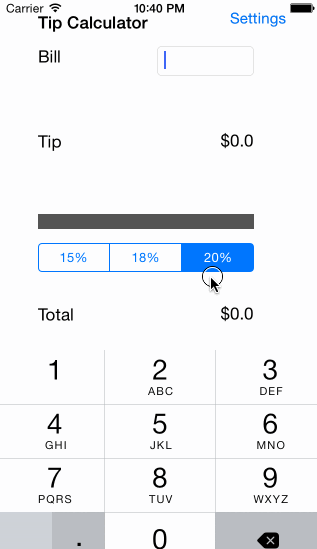

# Tip Calculator

This is an iOS Tip Calculator

Time spent: 4 hours spent in total

Completed user stories:

 * [x] Required: User can type in a bill amount and gets the tip and total amount
 * [x] Required: User can select the tip amount to be either 15%, 18% or 20%.
 * [x] Required: User can go to the Settings page to select a default tip amount
 * [x] Required: When the user leaves the settings page, the calculator loads the default tip amount
 * [ ] Optional: Remember amount across restarts
 * [ ] Optional: Internationalization
 * [ ] Optional: Dark/Light theme setting
 

Walkthrough of all user stories:

GIF created with [LiceCap](http://www.cockos.com/licecap/).
